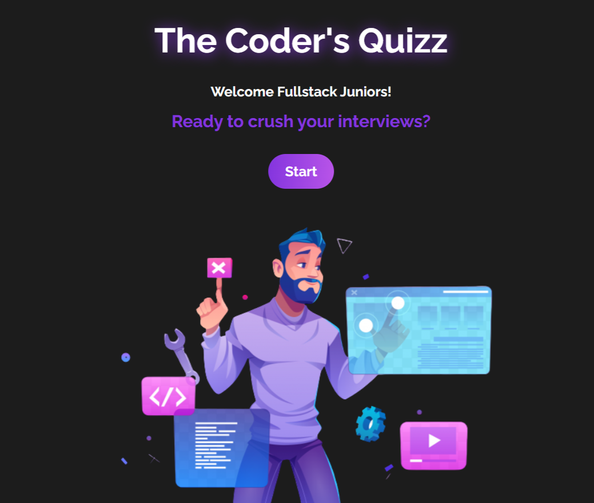

 

 
 

<h1>
  
  Coder Quizz
  </h1>

This website is a quizz made for Junior FullStack Developers to practice interview questions.

  
In the next stage of this project, I will be adding categories, allowing developers to choose specific types of questions based on their preferences or areas of focus.

   
Issue: Please be aware of a known issue in this project. While the quizz stops correctly the first time, when repeating the quizz, it may not stop properly. To ensure consistent functionality, I recommend refreshing the page after each "reset quizz".

 

<h2>

Usage
</h2>

To use and explore the website, access it by clicking <a href="https://sarafreitas-dev.github.io/Coder_Quizz/">here</a>.

 

<h2>

Technologies Used</h2>
  
HTML

  
CSS

  
JavaScript

  
React

  
Vine

  
NPM

   
  
<h2>

Features
</h2>
  
Use of react-confetti library for the confetti animation

  
Button Animation

  
State management with `useContext` hook from React

  
 Randomized questions: Each quiz session offers a unique experience as the questions are randomized, ensuring a fresh challenge every time

 

<h2>

License
</h2>

All rights reserved.

